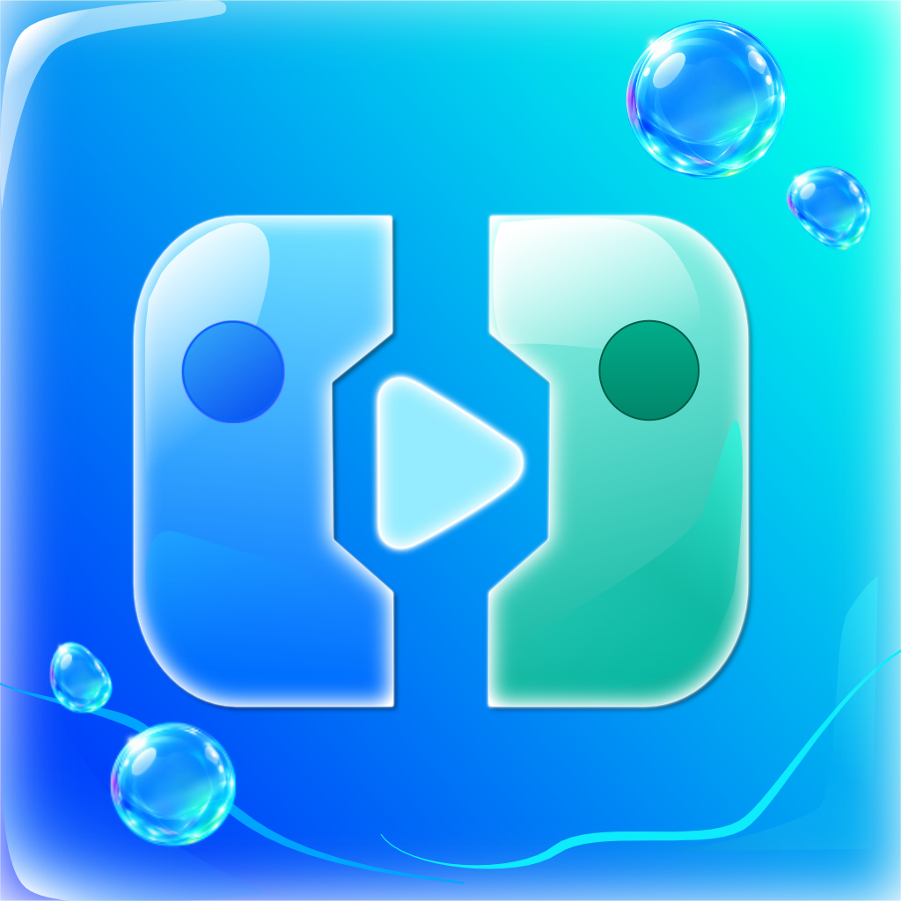

# AeroStation - FrontEnd

Um aplicativo que organiza suas ROMs com estética inspirada em Frutiger Aero e XMB com um toque de menu do Nintendo Switch.

 you can support this project here with ko-fi =)

## Utilização

[apresentação completa do aplicativo](https://www.youtube.com/watch?v=UfPRk3v5Qo0&t=6s)

Ao abrir o App pela primeira vez clique no ícone de adicionar jogos (+) e em seguida escolha a pasta onde você guardou e organizou seus jogos, é recomendavel que eles estejam separados por pastas, dessa forma:

| Pastas       | Jogos           |
| -------------- | ------------------------ |
| GBA | Sonic Advance, Zelda Minish Cap, Super Mario Advance [...] |
| PS1 | Resident Evil 2, Crash Bandicoot [...]|
| PS2 | Dragon Ball Z Budokai Tenkaichi 3, Resident Evil 4, God of War [...]|

Se clicar e segurar novamente no botão (🔃 ele permite escolher outra pasta. Ao lado desse botão você pode escolher uma foto de perfil, e se quiser pode também conectar sua conta do retroachievements nas configurações e ela aparecerá nesse espaço da tela.
Toque e segure sobre um jogo e você verá várias opções de customização, incluindo buscar imagens daquele jogo no SteamGridDB.

## Emuladores Suportados e Testados

| Plataforma       | Emulador            |
| -------------- | ------------------------ |
| GBA | MyBoy! e LinkBoy! (ainda falta o Pizzaboy para teste) |
| GB | LinkBoy! e Retroarch|
| GBC | LinkBoy! e Retroarch|
| NES | Retroarch|
| SNES | Retroarch|
| Sega Genesis| Retroarch |
| Sega CD| Não testado (em breve) |
| MasterSystem | Não testado (em breve) |
| Sega Saturn | Yaba Sanshiro 2 (abre a home, sem boot direto) e Retroarch |
| N64 | Retroarch|
| NDS | Drastic, Watermelon e SeedlessDS|
| 3DS | Citra MMJ (opção lowend) e Azahar |
| Switch | Eden e Skyline Edge |
| Gamecube | Dolphin e Dolphin MMJR2|
| Wii | Dolphin e Dolphin MMJR2|
| Wii U | Suportado com Cemu Android! |
| PSP | PPSSPP (O GOAT) |
| PS1 | Duckstation |
| PS2 | AetherSX2/NetherSX2 |
| PS3 | Planejado para o futuro! |
| PSVita | Vita3K Plus |
| DreamCast| Redream e Flycast |
| Java ME | J2ME Loader |
| Xbox Classico | Em Breve |
| Xbox 360 e One | Em Breve |

## Temas!🎨

Você pode criar e importar temas personalizados no aplicativo! basta acessar as configurações e procurar pela opção de temas, você poderá personalizar tudo que puder imaginar, deixe o app com o aspecto que você desejar! 

Se estiver no computador você também pode acessar uma versão web do criador de temas [aqui](https://bluetufiebugado.github.io/AeroStation/)

# Previa de alguns temas:

Playstation 2

Xbox 360

Sonic Generations

## Encontrei um erro, o que fazer?
Se um emulador seu não abrir/executar um jogo você pode abrir um issue aqui e me dizer qual emulador você está tentando usar para executar um jogo, e a plataforma também que você quer jogar, com isso posso adicionar o nome de pacote do app na programação para tentar bootar os jogos nele. Existem emuladores que não conseguem abrir jogos assim, como o Armsx2 por exemplo, e se esse for o caso informarei como resposta essa limitação e o unico jeito é esperar que o desenvolvedor do app adicione suporte.

Se o aplicativo crashar uma janela deve aparecer na sua tela falando que houve um crash e pedindo para você copiar ou compartilhar o log, nesse caso copie o log, abra um issue e diga o que aconteceu deixando o log para que eu possa analisar e concertar o problema. (Ou pelo menos tentar resolver)

## E jogos de PC? (Winlator/Gamehub/Gamenative/etc)
Suporte experimental adicionado na V1.0:
- **GameNative**: boot direto pelo ID da loja (action `app.gamenative.LAUNCH_GAME`, confirmada no fonte). Como ele não abre `.exe` por intent, mapeie o jogo uma vez (segurar > Definir ID da loja) com o AppID da Steam/Epic/GOG/Amazon — o jogo precisa estar instalado nele.
- **Winlator e GameHub**: não têm API pública de boot externo (só a home é exportada), então o app abre a home deles pra você escolher o jogo lá dentro.

## Creditos e agradecimentos

A música de fundo do app foi feita por um compositor chamado A-duration Music, e a música em questão se chama "Glass". Eu não sou um bom compositor então decidi usar a música dele nesse projeto por ele mesmo incentivar e permitir o uso livre das músicas dele. Então, nesse caso agradeço muito, mas se houver problema futuramente com copyright, a música e as versões com ela associada serão removidas.
